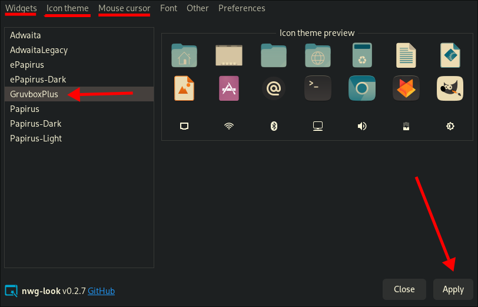
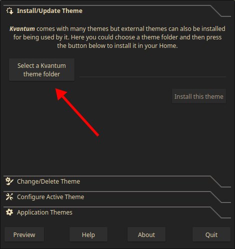
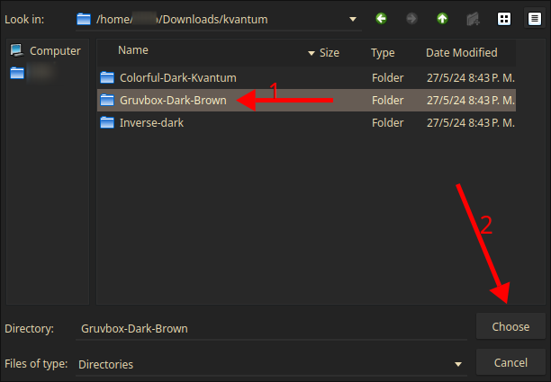
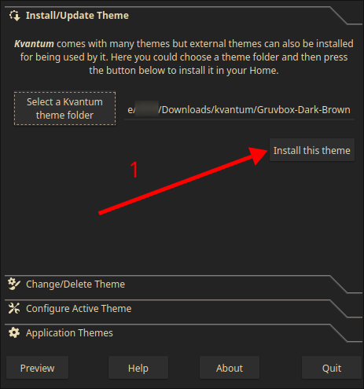
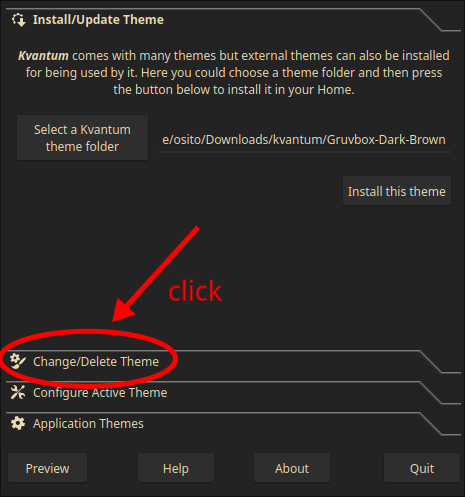
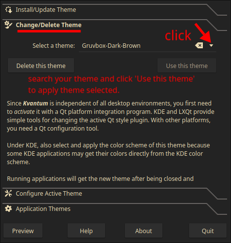
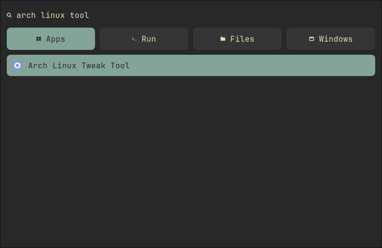
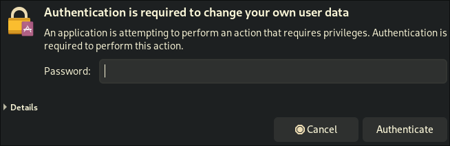
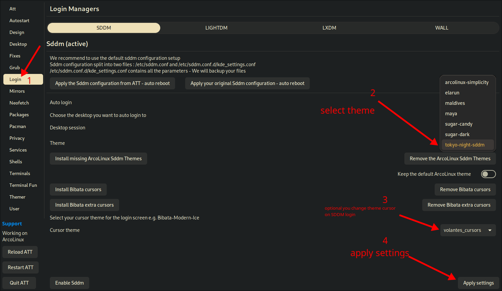

# Rice Hyperland

<p align="left">
    
    
    
    
</p>

<p align="left">Configuration for <a href="https://github.com/hyprwm/Hyprland">Hyprland</a>.</p>

---

**_Language_**

- [🇪🇸 Español](./README.es.md)
- 🇺🇸 English

# Table of Contents

- [Packages](#packages)
- [Instructions to install](#instructions-to-install)
- [Basic configuration](#basic-configuration)
  - [Fonts](#fonts)
  - [Wallpaper](#wallpaper)
  - [Monitors](#monitors)
  - [Notifications](#notifications)
  - [Waybar](#waybar)
    - [Initial configuration](#initial-configuration)
    - [Module weather](#api-key-weather-module)
    - [Configure "battery" module](#configure-“battery”-module)
    - [Configure custom module](#configure-custom-module)
    - [Create custom moodule](#create-custom-module)
  - [Rofi](#rofi)
  - [GTK Theming](#gtk-theming)
  - [Qt](#qt)
  - [SDDM Change theme](#sddm-change-theme)
- [Keybinding](#keybindings)

### Packages

This configuration contains the necessary configuration packages for the operation of the following packages:

- Hyprland (WM, Keybinding, Wallpaper, Lockscreen) [hyprland](https://github.com/hyprwm/Hyprland) [hyprpaper](https://github.com/hyprwm/hyprpaper) [hyprlock](https://github.com/hyprwm/hyprlock)
- Mako (Notification center) [mako](https://github.com/emersion/mako)
- Rofi (Launcher) [rofi wayland](https://github.com/lbonn/rofi)
- Sddm (Login manager) [sddm](https://github.com/sddm/sddm)
- Waybar (Bar) [waybar-git](https://github.com/Alexays/Waybar)

### Instructions to install

Clone the repository

```bash
git clone --depth=1 https://github.com/OSITO326/Rice_Hyprland.git Rice_Hyprland && chmod +x Rice_Hyprland/Scripts/install.sh && Rice_Hyprland/Scripts/install.sh
```

# Basic configuration

In this section, we will cover some of the configuration software that is needed for this system setup. However, please note that the changes we are going to make will not be permanent. You can modify them as you wish.

## Fonts

For the correct functioning of glyphs in Waybar, these sources are necessary.

- Awesome fonts v6 pro ([free](https://fontawesome.com/v6/download) version).
- JetBrainsMono Nerd Font Mono ([link](https://www.nerdfonts.com/font-downloads) )

## Wallpaper

First things first, your screen will have wall0.png as its wallpaper if you are using only one monitor, and if you have the 2nd monitor connected it will have wall1.png as its wallpaper, so you may want to have a wallpaper that suits your tastes.
To change the wallpaper go to the location `.config/hypr/` and edit the file `hyprpaper.conf`. This is what the file will contain.

```conf
preload = ~/Pictures/Wallpapers/wall0.png
preload = ~/Pictures/Wallpapers/wall1.png
wallpaper = eDP-1,~/Pictures/Wallpapers/wall0.png
wallpaper = HDMI-A-1,~/Pictures/Wallpapers/wall1.png
```

We will only have to modify the paths with the wallpaper you want, to know which formats hyprpaper supports, check its [documentation](https://github.com/hyprwm/hyprpaper).

PD. See [Monitors](#monitors) to change variable the output video driver. `eDP-1` `HDMI-A-1`.

## Monitors

If you have a multi-monitor system, you surely want to use all your screens. To do this go to `.config/hypr/` and edit the `hyprland.conf` file. Find the monitors section in the file.

```conf
################
### MONITORS ###
################

# See https://wiki.hyprland.org/Configuring/Monitors/
# monitor=name,resolution,position,scale
# hyprctl monitors all
monitor=eDP-1,1920x1080@60,0x0,1
monitor=HDMI-A-1,1920x1080@60,1920x0,1 # Monitor 60hz
# monitor=HDMI-A-1,1920x1080@120,1920x0,1 # Monitor 120hz
```

You may be wondering where `eDP-1` or `HDMI-A-1` come from. To do this, run the following command in the terminal: `hyprctl monitors`

```bash
hyprctl monitors
Monitor eDP-1 (ID 0):
	1920x1080@60.00000 at 0x0
	description: Samsung Display Corp. 0x4146
	make: Samsung Display Corp.
	model: 0x4146
	serial:
	active workspace: 5 (5)
	special workspace: 0 ()
	reserved: 0 25 0 0
	scale: 1.00
	transform: 0
	focused: yes
	dpmsStatus: 1
	vrr: 0
	activelyTearing: false
	disabled: false
	currentFormat: XRGB8888
	availableModes: 1366x768@60.00Hz

Monitor HDMI-A-1 (ID 1):
	1920x1080@120.00000 at 1920x0
	description: ASUSTek COMPUTER INC ASUS VG277Q1A 0x00034F09
	make: ASUSTek COMPUTER INC
	model: ASUS VG277Q1A
	serial: 0x00034F09
	active workspace: 7 (7)
	special workspace: 0 ()
	reserved: 0 25 0 0
	scale: 1.00
	transform: 0
	focused: no
	dpmsStatus: 1
	vrr: 0
	activelyTearing: false
	disabled: false
	currentFormat: XRGB8888
	availableModes: 1920x1080@120.00Hz 1920x1080@119.88Hz 1920x1080@60.00Hz 1920x1080@60.00Hz 1920x1080@59.94Hz 1920x1080@50.00Hz 1680x1050@59.88Hz 1280x1024@75.03Hz 1280x1024@60.02Hz 1440x900@59.90Hz 1280x960@60.00Hz 1152x864@75.00Hz 1280x720@60.00Hz 1280x720@60.00Hz 1280x720@59.94Hz 1280x720@50.00Hz 1440x576@50.00Hz 1440x576@50.00Hz 1024x768@75.03Hz 1024x768@70.07Hz 1024x768@60.00Hz 1440x480@60.00Hz 1440x480@60.00Hz 1440x480@59.94Hz 1440x480@59.94Hz 800x600@75.00Hz 800x600@72.19Hz 800x600@60.32Hz 800x600@56.25Hz 720x576@50.00Hz 720x576@50.00Hz 720x480@60.00Hz 720x480@60.00Hz 720x480@59.94Hz 720x480@59.94Hz 640x480@75.00Hz 640x480@72.81Hz 640x480@66.67Hz 640x480@60.00Hz 640x480@59.94Hz 640x480@59.94Hz 720x400@70.08Hz
```

To modify Hz in your monitor edit this line:

```conf
# monitor=HDMI-A-1,1920x1080@120,1920x0,1 # Monitor 120hz
```

More information to configure monitor see [this](https://wiki.hyprland.org/Configuring/Monitors/).

## Notifications

Notification center with `mako`, to configure the "default" settings go to `.config/mako/` and edit `config` file.
You edit as your like, for example change the font:

```bash
font=JetBrainsMono Nerd Font Mono Ultra-Bold 10
```

You change the font size, whatever you want. To see more variables to configure run this command:

```bash
man 5 mako
```

And you can see all values.

## Waybar

Highly customizable Wayland [bar](https://github.com/Alexays/Waybar) for Sway and Wlroots based compositors.
You need to know how to configure the modules [here](https://github.com/Alexays/Waybar/wiki/Module:-Backlight-Slider) module section.

##### Initial configuration

In this initial configuration, it will only be to add or remove any module that you do not use, for this we will go to this location: `~/.config/waybar/config.jsonc`

```jsonc
[
  // Monitor
  {
    "layer": "top", // Waybar position (top|bottom|left|right)
    "output": "eDP-1", // Waybar output
    "include": "~/.config/waybar/modules/modules.jsonc",
    "spacing": 3, // Gaps between modules (4px)
    "height": 25,
    // MODULES
    "modules-left": ["hyprland/workspaces", "hyprland/window"],
    "modules-center": ["clock"],
    "modules-right": [
      "group/group-widgets",
      "group/group-system",
      "network",
      "group/group-data",
    ],
  },
  // HDMI-A-1
  {
    "layer": "top", // Waybar position (top|bottom|left|right)
    "output": "HDMI-A-1", // Waybar output
    "include": "~/.config/waybar/modules/modules.jsonc",
    "spacing": 3, // Gaps between modules (4px)
    "height": 25,
    // MODULES
    "modules-left": ["hyprland/workspaces", "hyprland/window"],
    "modules-center": ["clock"],
    "modules-right": ["mpris", "custom/docker", "custom/weather"],
  },
]
```

The first thing to take into account is the video adapter, in my case they are with `eDP-1` and `HDMI-A-1`.
To know what the output is, see [this](#monitors) section.
To delete modules, just delete in the values:

- `modules-left`: `["hyprland/workspaces"],` Remove module `hyprlan/window`
- `modules-center`: `["clock"],`
- `modules-right`: `["mpris", "custom/weather"]` Remove module `custom/docker`

##### API KEY weather module

You may have problems with the operation of the "weather" module. It will not work because you need an API KEY for it to work correctly.
The script location is at: `~/.config/waybar/scripts/weather.py`

```python
API_KEY = ""  # Your API here
UNITS = "Metric"
UNIT_KEY = "C"
LANG = "es"
# UNIT_KEY = "F"
# LANG = "en"
```

You can change the language `LANG = "es"` `LANG = "en"` (spanish or english) or change the temperature degrees to fahrenheit in `UNIT_KEY = "F"`. To set your city in the script go [here](https://openweathermap.org/city) search your city for example New York is `https://openweathermap.org/city/5128581` and modify this line:

```python
CITY = "5128581"
```

For the API KEY just create an account [here](https://home.openweathermap.org/users/sign_up), once registered go here to create [API KEY](https://openweathermap.org/api). Havin the API KEY just put it here:

```python
API_KEY = "qwerty12345" # Your API here
```

##### Configure "battery" module

To configure the modules in the following path `~/.config/waybar/modules/modules.jsonc`

Example: Edit `modules.jsonc` search "battery" [module](https://github.com/Alexays/Waybar/wiki/Module:-Battery).

```jsonc
{
  "battery": {
    "bat": "BAT1", // run command ls /sys/class/power_supply/
    "adapter": "ACAD", // run command ls /sys/class/power_supply/
    "interval": 5,
    "states": {
      "warning": 30,
      "critical": 15,
    },
    "format": " {icon} {capacity}% ",
    "format-icons": {
      "charging": [
        "<span font='11' font-family=\"JetBrainsMono Nerd Font Mono\">󰢜</span>",
        "<span font='11' font-family=\"JetBrainsMono Nerd Font Mono\">󰂆</span>",
        "<span font='11' font-family=\"JetBrainsMono Nerd Font Mono\">󰂇</span>",
        "<span font='11' font-family=\"JetBrainsMono Nerd Font Mono\">󰂈</span>",
        "<span font='11' font-family=\"JetBrainsMono Nerd Font Mono\">󰢝</span>",
        "<span font='11' font-family=\"JetBrainsMono Nerd Font Mono\">󰂉</span>",
        "<span font='11' font-family=\"JetBrainsMono Nerd Font Mono\">󰢞</span>",
        "<span font='11' font-family=\"JetBrainsMono Nerd Font Mono\">󰂊</span>",
        "<span font='11' font-family=\"JetBrainsMono Nerd Font Mono\">󰂋</span>",
        "<span font='11' font-family=\"JetBrainsMono Nerd Font Mono\">󰂅</span>",
      ],
      "default": [
        "<span font='11' font-family=\"JetBrainsMono Nerd Font Mono\">󰁺</span>",
        "<span font='11' font-family=\"JetBrainsMono Nerd Font Mono\">󰁻</span>",
        "<span font='11' font-family=\"JetBrainsMono Nerd Font Mono\">󰁼</span>",
        "<span font='11' font-family=\"JetBrainsMono Nerd Font Mono\">󰁽</span>",
        "<span font='11' font-family=\"JetBrainsMono Nerd Font Mono\">󰁾</span>",
        "<span font='11' font-family=\"JetBrainsMono Nerd Font Mono\">󰁿</span>",
        "<span font='11' font-family=\"JetBrainsMono Nerd Font Mono\">󰂀</span>",
        "<span font='11' font-family=\"JetBrainsMono Nerd Font Mono\">󰂁</span>",
        "<span font='11' font-family=\"JetBrainsMono Nerd Font Mono\">󰂂</span>",
        "<span font='11' font-family=\"JetBrainsMono Nerd Font Mono\">󰁹</span>",
      ],
    },
    "format-full": " <span font='11' font-family=\"JetBrainsMono Nerd Font Mono\">󰂄 Full</span> ",
  }
```

For the correct operation of "bat" and "adapter" execute the following command in terminal:

```bash
ls /sys/class/power_supply/
 ACAD   BAT1
```

This example is clear to modify any module you want in the `modules.jsonc` file.

##### Configure custom module

As an example we will take the installed package updates module or you can see [here](https://github.com/Alexays/Waybar/wiki/Module:-Custom) how to create a new module where we will also make an example.

```jsonc
  // Custom module check updates
  "custom/arch": {
    "format": " {icon} {}",
    "tooltip-format": "Packages to Update\n{icon}: {}",
    "format-icons": [
      "<span color=\"#d79921\" font-family=\"Font Awesome 6 Pro Solid\"></span>",
    ],
    "restart-interval": 1800, // 30 minutes
    "exec": "bash ~/.config/waybar/scripts/arch-updates.sh",
    "tooltip": false,
  }
```

- `arch-updates.sh`

```bash
#!/bin/sh

# if now working the command, install the package pacman-contrib
if ! updates_arch=$(checkupdates 2> /dev/null | wc -l); then
    updates_arch=0
fi

if [ $updates_arch -gt 0 ]; then
    echo $updates_arch
else
    echo "0"
fi
```

In the documentation for creating [custom](https://github.com/Alexays/Waybar/wiki/Module:-Custom) modules, we will have variables to take into account such as: `format` `restart-interval` `exec`.
These variables mentioned above will be the:

- `format`: to format the output (String).
- `restart-interval`: the command will be executed every certain time.
- `exec`: the location of the script to be executed

  > [!NOTE]
  > The script can be written in any other language, it can be python for example.
  > To see an example of a customizable module with a python script. `modules.jsonc` "custom/weather".

##### Create custom module

For this custom module, we will make a module that shows the IP of the VPN we are using.

- Create custom module in `~/.config/waybar/modules/modules.jsonc`

```jsonc
  // Custom module vpn
  "custom/vpn": {
    "format": " {icon} {} ",
    "format-icons": [
      "<span color=\"#b16286\" font-family=\"Font Awesome 6 Pro Solid\"></span>",
    ],
    "restart-interval": 30, // 30 seconds
    "exec": "bash ~/.config/waybar/scripts/vpn.sh",
    "tooltip": false,
  },
```

- Create file `vpn.sh` in `~/.config/waybar/scripts/vpn.sh`

```bash
#!/bin/sh

IFACE=$(/usr/sbin/ifconfig | grep tun0 | awk '{print $1}' | tr -d ':')

if [ "$IFACE" = "tun0" ]; then
    echo "$(/usr/sbin/ifconfig tun0 | grep "inet " | awk '{print $2}')%{u-}"
else
    #echo " Disconnected"
    echo "N/A"
fi
```

- run write permissions to the script with `chmod +x vpn.sh`

- Customize module with css in `~/.config/waybar/style.css`

```css
/* VPN */
#custom-vpn {
  border-radius: 12px 12px 12px 12px;
  margin: 3px 0 0 0;
  padding: 0 3px 0 3px;
  color: @white;
  background-color: @black;
  box-shadow: 0px 0px 3px rgba(0, 0, 0, 1);
}
```

- Set module in `~/.config/waybar/config.jsonc`, add the module to any monitor output you like.

Set in HDMI-A-1 in `modules-right`

```jsonc
[
  // Monitor
  {
    "layer": "top", // Waybar position (top|bottom|left|right)
    "output": "eDP-1", // Waybar output
    "include": "~/.config/waybar/modules/modules.jsonc",
    "spacing": 3, // Gaps between modules (4px)
    "height": 25,
    // MODULES
    "modules-left": ["hyprland/workspaces", "hyprland/window"],
    "modules-center": ["clock"],
    "modules-right": [
      "group/group-widgets",
      "group/group-system",
      "network",
      "group/group-data",
    ],
  },
  // HDMI-A-1
  {
    "layer": "top", // Waybar position (top|bottom|left|right)
    "output": "HDMI-A-1", // Waybar output
    "include": "~/.config/waybar/modules/modules.jsonc",
    "spacing": 3, // Gaps between modules (4px)
    "height": 25,
    // MODULES
    "modules-left": ["hyprland/workspaces", "hyprland/window"],
    "modules-center": ["clock"],
    "modules-right": ["mpris", "custom/docker", "custom/vpn", "custom/weather"],
  },
]
```

Log out and login to see the changes or run this command:

```bash
killall waybar
waybar &
```

Check that the module is there:

<p align="center">
  
</p>

## Rofi

A window switcher, Application launcher and dmenu replacement. You see the [documentation](https://github.com/lbonn/rofi).
To configure rofi To configure rofi, we have 5 launchers to configure as colorschemes 'themes' (Drun, Emoji, FilesBrowser, Clipboard, PowerMenu).

##### **Change colorscheme and fonts on (Drun, Emoji, FilesBrowser, Clipboard)**

The location path to configure are: `~/.config/rofi/theme/launcher/shared/colors.rasi` to colorschemes or `~/.config/rofi/theme/launcher/shared/fonts.rasi` to fonts.

```config
/* Import color-scheme from `colors` directory */

@import "~/.config/rofi/colors/gruvbox.rasi"
```

To change colorschemes available are in this path `~/.config/rofi/colors/`, just change it to the one you like the most.

- List colorschemes available: `adapta catppuccin everforest navy paper arc cyberpunk gruvbox nord solarized black dracula lovelace onedark yousai`.

Example:

```config
@import "~/.config/rofi/colors/onedark.rasi"
```

##### **Change colorscheme and fonts on (PowerMenu)**

The location path to configure are: `~/.config/rofi/theme/powermenu/style/shared/colors.rasi` to colorschemes or `~/.config/rofi/theme/powermenu/style/shared/fonts.rasi` to fonts.

```config
/* Import color-scheme from `colors` directory */

@import "~/.config/rofi/colors/gruvbox.rasi"
```

To change colorschemes available are in this path `~/.config/rofi/colors/`, just change it to the one you like the most.

- List colorschemes available: `adapta catppuccin everforest navy paper arc cyberpunk gruvbox nord solarized black dracula lovelace onedark yousai`.

Example:

```config
@import "~/.config/rofi/colors/onedark.rasi"
```

### GTK theming

The moment you have been wating for has arrived, you are finally going to
install a dark theme. I use _Material Black Colors_, so go grab a flavor
[here](https://www.gnome-look.org/p/1316887/) and the matching icons
[here](https://www.pling.com/p/1333360/).

I suggest starting with
_Material-Black-Blueberry_ and _Material-Black-Blueberry-Suru_. You can find
other GTK themes [on this page](https://www.gnome-look.org/browse/cat/135/).
Once you have your theme folders downloaded, this is what you do:

```bash
# Assuming you have downloaded Material-Black-Blueberry
cd Downloads/
sudo pacman -S unzip
unzip Material-Black-Blueberry.zip
unzip Material-Black-Blueberry-Suru.zip
rm Material-Black*.zip

# Make your themes available
sudo mv Material-Black-Blueberry /usr/share/themes
sudo mv Material-Black-Blueberry-Suru /usr/share/icons
```

Or open with rofi `GTK Settings` is a GUI to select and apply your Icon Theme or Mouse cursor.

Next time you log in, these changes will be visible. The theme I use is
[Breeze](https://www.gnome-look.org/p/999927/), download it and then:

```bash
sudo pacman -S xcb-util-cursor
cd Downloads/
tar -xf Breeze.tar.gz
sudo mv Breeze /usr/share/icons
```

Or open with rofi `GTK Settings` is a GUI to select and apply your mouse cursor.

<p align="center">
    
</p>

### Qt

GTK themes will not be applied to Qt programs, but you can use
[**Kvantum**](https://store.kde.org/browse?cat=123&ord=latest) to search and change the default theme.

Open with rofi `Kvantum Manager` is a GUI to apply theme.

<p align="center">
    
</p>

<p align="center">
    
</p>

<p align="center">
    
</p>

<p align="center">
    
</p>

<p align="center">
    
</p>

### SDDM change theme

To change the SDDM login, we need to have `Archlinux-Tweak-Tool` if you executed all scrits you have it installed.
To run only open Rofi and write `Arch Linux Tool`.

<p align="center">
    
</p>

This application needs root permissions, if you run a window to enter the root password.

<p align="center">
    
</p>

<p align="center">
    
</p>

### Keybindings

Now that you're in Hyprland, you should know some of the default keybindings.
To change some app or add new keybindings, edit this file `~/.config/hypr/configs/keybinds.conf`

| Key                            | Action                                |
| ------------------------------ | ------------------------------------- |
| **mod + Return**               | launch kitty (terminal)               |
| **mod + E**                    | thunar (file browser)                 |
| **mod + B**                    | brave (browser)                       |
| **mod + M**                    | spotify (music)                       |
| **mod + N**                    | simplenote (notes app)                |
| **mod + Space**                | rofi (launcher)                       |
| **mod + .**                    | rofi (emoji-launcher)                 |
| **mod + Shift+E**              | rofi (launcher-Files)                 |
| **mod + V**                    | rofi (clipboard manager)              |
| **mod + Shift+P**              | rofi (powermenu)                      |
| **mod + X**                    | hyprlock (Lockscreen)                 |
| **mod + Shift + -**            | brightness down                       |
| **mod + Shift + =**            | brightness up                         |
| **mod + Shift + .**            | volume down                           |
| **mod + Shift + ,**            | volume up                             |
| **Print**                      | screenshot                            |
| **mod + W**                    | kill window active                    |
| **mod + S**                    | float window                          |
| **mod + ,**                    | fullscreen window                     |
| **mod + P**                    | window dwindle                        |
| **mod + h**                    | move focus window left                |
| **mod + j**                    | move focus window down                |
| **mod + k**                    | move focus window up                  |
| **mod + l**                    | move focus window right               |
| **mod + Shift + h**            | switch window left                    |
| **mod + Shift + j**            | switch window down                    |
| **mod + Shift + k**            | switch window up                      |
| **mod + Shift + l**            | switch window right                   |
| **mod + [1234567890]**         | go to workspace [1234567890]          |
| **mod + Shift + [1234567890]** | move window to workspace [1234567890] |
| **ALT + Tab**                  | switch tab                            |
| **ALT + Shift + Tab**          | switch tab previous                   |
| **mod + Tab**                  | cycle recent workspace                |
| **mod + Ctrl + Q**             | logout                                |
